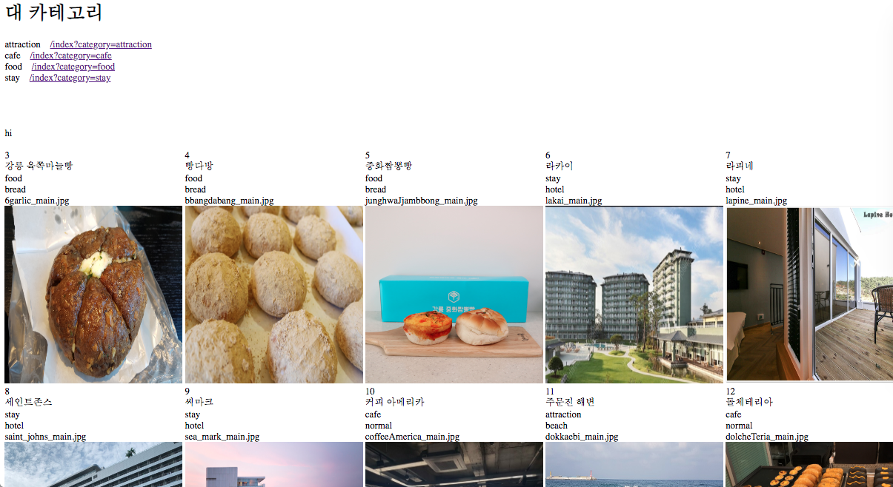

서버 IP : 115.68.207.68
프론트 repository : https://github.com/BG1346/GGY-vue

ERD

# 19.9.30

### 이슈사항

DBmigration 시도중
	리눅스 서버에 mariadb를 설치하고 mysql -h 호스트명@아이피주소 -u 유저ID -p로 접속을 시도했으나 unknown serverhost라는 결과가 나오고 있음. 

### 학습내용

linux서버에 대한 전체적인 학습

### 지적사항 보완

* IP다음 경로 없애기

완료

* yum repository 이해하기

rpm의 보완 패키지 설치 도구로써 의존성이 있는 패키지들을 자동으로 설치해준다. 의존성이 있는 패키지에 대해 yum명령어를 실행하면 의존 패키지를 자동으로 설치해 준다. rpm은 설치하려는 rpm파일이 DVD에 있거나 인터넷에서 미리 다운로드 후 설치해야 한다. 하지만 YUM은 CentOS가 제공하는 rpm 파일 저장소(repository)에 설치할 패키지 파일과 의존 패키지들을 모두 설치한다. 저장소의 URL은 /etc/yum.repos.d/에 저장해둔다. 인터넷에서 설치하기 때문에 인터넷 연결이 필수적이다.

* 서비스 상시가동 시키기

CentOS6까지는 chkconfig명령으로 자동 부팅 여부를 설정할 수 있었지만 Ubuntu 16, CentOS7부터는 systemctl enable명령을 사용하면 된다. 

# 19.10.1

### 이슈사항

* index.php없애기 

실패

### 학습내용

* 비로그인 추천기능, 세션활용

### 보완점

* DBmigration

완료, apm을 최신버전으로 바꾸고 포트변경. 

#### 로컬서버

php 7.1

mariadb 10.4.6

# 19.10.2

### 보완사항
* index.php없애기
완료. scp명령을 쓸 때 히든파일이 옮겨지지 않아 .htaccess를 따로 만들었고 httpd.conf 파일을 수정할 떄 "var/www/html" doumentroot가 따로 있어서 그냥 documentroot의 설정을 변경해도 index.php가 사라지지 않았음. 
centos의 httpd.conf 경로는 etc/httpd/conf
apache 2.4.33

#### 원격 서버

php 5.4.16

mariadb 5.5.64

apache 2.4.6

#### 변경

php 7.1.32

mariadb 10.4.8

# 19.10.8

### 이슈사항

* table doesn't exist in engine
innodb엔진인 테이블을 원격서버로 옮겼으나 테이블의 engine이 NULL로 바뀌고 어떠한 명령어도 되지 않음. 

### 카테고리 세분화
category

 ㄴ subcategory

#### category (ㄴ subcategory)
stay

ㄴ motel

ㄴ hotel

ㄴ guest house

ㄴ etc

cafe

ㄴ normal

ㄴ abnormal

ㄴ etc

foot

ㄴ meal

ㄴ bread

ㄴ etc

attraction

ㄴ cultural heritage

ㄴ beach 

